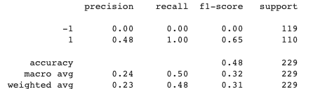
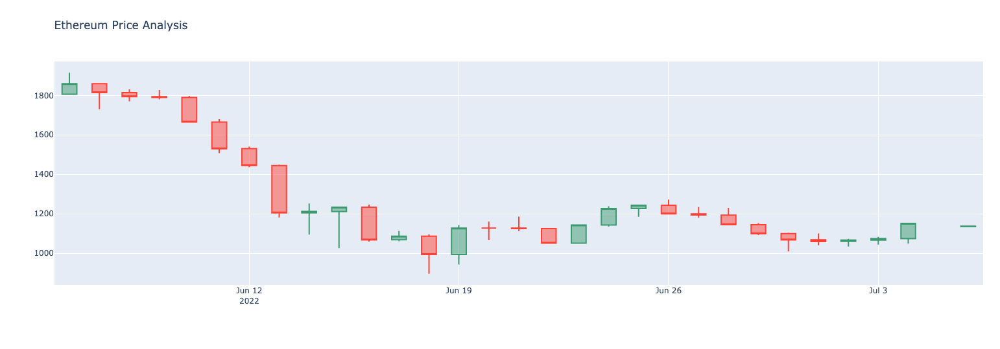
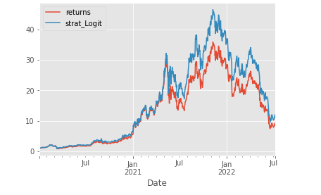
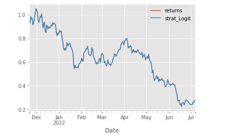
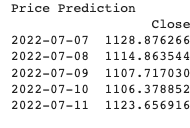
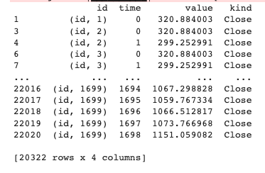
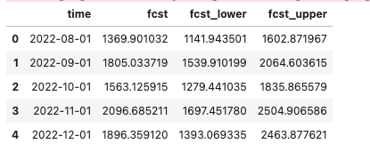

Ethereum Price Predictor

### This tool runs future price predictions of Ethereum through muliple machine-learning model types and time periods.The intent of this tool is to help the user predict up trends and downtrends in the market or to DCA (Dollar Cost Averaging).  It's also a guide to help predict maximum returns for 2022.

The main research question we wanted to explore was what is the optimal machine learning model to predict Ethereum prices in the near future.

- Disclaimer: the content contained in this project is for informational purposes only and the user should not construe any such information as investment, financial, tax, legal or other advise. Any ideas or strategies discussed herein should not be undertaken by any individual without prior consultation with a financial professional for the purpose of assessing whether the ideas or strategies that are discussed are suitable to you based on your own personal financial objectives, needs and risk tolerance.

---

## Technologies

This project leverages python 3.9 and Google Colab was used to run all analysis.

We used the following tools to gather information:

- [Yahoo Finance API](https://www.https://www.yahoofinanceapi.com/) - this method allows you to connect to the Yahoo servers via Python to pull live financial data.

---

## Installation Guide

Before running the application first import the following libraries and dependencies.

```python
!pip install pandas
!pip install numpy
!pip install yfinance
!pip install tsfresh
!pip install kats
!pip install autots

import yfinance as yf
import numpy as np
import datetime
from datetime import date, timedelta
from autots import AutoTS

from kats.consts import TimeSeriesData
from kats.models.prophet import ProphetModel, ProphetParams


For training and testing data:
from sklearn.linear_model import LogisticRegression

Import the classifier Models

from tsfresh import extract_features, extract_relevant_features, select_features
from tsfresh.utilities.dataframe_functions import impute, make_forecasting_frame
from tsfresh.feature_extraction import ComprehensiveFCParameters, settings

```

---

## Data Preparation

All data was pulled from yahoo finance api.  We also downloaded Ethereum prices from 2017 to Current time. ETH-USD.CSV was used in KATS_Ethereum_Predictor and TSFRESH_Ethereum_predictor.  

**Crypto coin**:
Ethereum

**Timeframes**: 
1D, 30D


**4 Machine Learning Models**:
AutoTS - Automated Time Series Forecasting
Kats - Kits to Analyze Time Series
Tsfresh - Automated feature extraction and selection library for time series data
Prophet - forecasting procedure


The following are four files in our package:

- Long_or_Short_Ethereum: this program was used for indicator to short or go long on Ethereum.  -1 was to short and 1 was to go long.  Result was to go long on Ethereum




- KATS_Ethereum_Predictor: this ML model predicted Ethereum prices on the first of every month in the near future.

- Ethereum_Price_Prediction: this is the main file to predict 5 days into the future for Ethereum.

- TSFRESH_Ethereum_predictor: We gathered data from this ML model.  The data at the end was all over the place.  The data that go spit out we believe is 5 days into the near future.
---

## Results







AutoTs results :



2022-07-07 1253.13 According to CoinMarketCap

TSFresh :



KATS :




## Conclusion

Looks like we already bottomed out from the market and market has been positive the past 4 days.  We could be heading toward a small recovery and from KATS data we could be seeing a mini bull in November 2022.  Possiblilty to go long on Ethereum or DCA and sell during November for maximum profit.  And then short it in December.


## Contributors

Kelvin Le - KelvinLe@live.com

Thomas Christopher Burns - burns235577@gmail.com

Aaron Rogers - ajrogers1776@gmail.com

---

## License

The MIT License (MIT)
Copyright © 2022 <copyright holders>

Permission is hereby granted, free of charge, to any person obtaining a copy of this software and associated documentation files (the “Software”), to deal in the Software without restriction, including without limitation the rights to use, copy, modify, merge, publish, distribute, sublicense, and/or sell copies of the Software, and to permit persons to whom the Software is furnished to do so, subject to the following conditions:

The above copyright notice and this permission notice shall be included in all copies or substantial portions of the Software.

THE SOFTWARE IS PROVIDED “AS IS”, WITHOUT WARRANTY OF ANY KIND, EXPRESS OR IMPLIED, INCLUDING BUT NOT LIMITED TO THE WARRANTIES OF MERCHANTABILITY, FITNESS FOR A PARTICULAR PURPOSE AND NONINFRINGEMENT. IN NO EVENT SHALL THE AUTHORS OR COPYRIGHT HOLDERS BE LIABLE FOR ANY CLAIM, DAMAGES OR OTHER LIABILITY, WHETHER IN AN ACTION OF CONTRACT, TORT OR OTHERWISE, ARISING FROM, OUT OF OR IN CONNECTION WITH THE SOFTWARE OR THE USE OR OTHER DEALINGS IN THE SOFTWARE.


